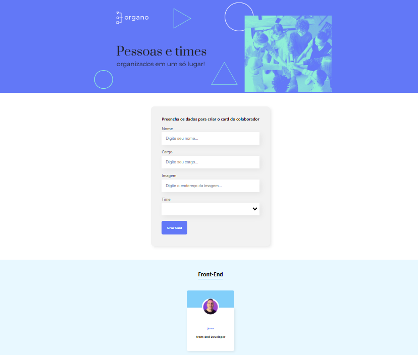

  

## 🖥️ Projeto

O projeto é um organizador de equipes feito em React, que simula um ambiente de trabalho real, onde os usuários criam seus cards com seus respectivos nomes e equipes.

## 🚀 Tecnologias

Esse projeto foi desenvolvido com as seguintes tecnologias:

- REACT
- HTML
- CSS
- JAVASCRIPT
- VERCEL (deploy)
- GIT e GITHUB
